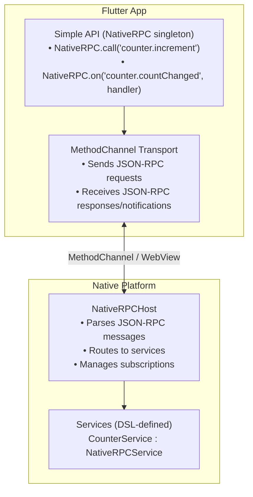
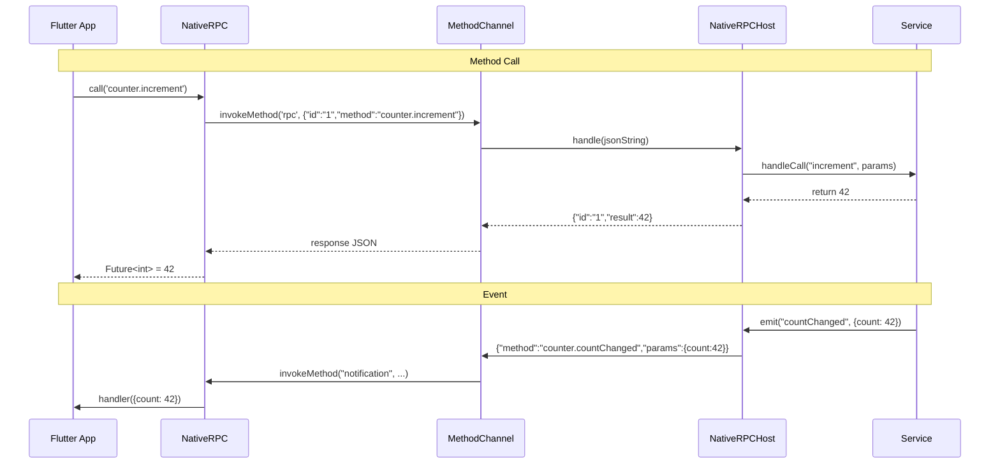

# NativeRPC Architecture

## Overview

NativeRPC is a protocol-first RPC framework focused on:
1. **Declarative DSL** - Expo Modules-style service definitions for iOS/Android
2. **Type-safe Flutter client** - Generated client code with full type safety
3. **Simplified JSON-RPC 2.0 Protocol** - Standard message format without `jsonrpc` field
4. **Unified API** - Consistent experience across Swift, Kotlin, and Dart

## Protocol

NativeRPC uses a **simplified JSON-RPC 2.0** protocol:

### Request Format
```json
{
  "id": "1",
  "method": "counter.increment",
  "params": {"step": 1}
}
```

### Response Format (Success)
```json
{
  "id": "1",
  "result": 42
}
```

### Response Format (Error)
```json
{
  "id": "1",
  "error": {
    "code": -32601,
    "message": "Method not found"
  }
}
```

### Notification Format (Event)
```json
{
  "method": "counter.countChanged",
  "params": {"count": 42}
}
```

### Subscribe/Unsubscribe
```json
{"id": "sub_1", "method": "rpc.subscribe", "params": {"event": "counter.countChanged"}}
{"id": "unsub_1", "method": "rpc.unsubscribe", "params": {"event": "counter.countChanged"}}
```

## Error Codes (JSON-RPC 2.0 Standard)

| Code | Name | Description |
|------|------|-------------|
| -32700 | Parse error | Invalid JSON |
| -32600 | Invalid Request | Invalid request object |
| -32601 | Method not found | Method doesn't exist |
| -32602 | Invalid params | Invalid parameters |
| -32603 | Internal error | Internal error |
| -32001 | Service not found | Service doesn't exist |
| -32002 | Event not found | Event doesn't exist |
| -32003 | Timeout | Request timed out |
| -32004 | Connection error | Connection failed |

## Directory Structure

```
NewDesign/
├── sdk/
│   ├── ios/               # Swift SDK (NativeRPCKit)
│   │   └── Sources/NativeRPCKit/
│   │       ├── Core/      # Host, Service, Message, Error
│   │       ├── DSL/       # ServiceDefinitionBuilder
│   │       └── Connection/
│   └── android/           # Kotlin SDK
├── connections/
│   └── flutter/
│       └── native_rpc_flutter/   # Flutter plugin (all-in-one)
├── generator/             # Code generator
├── examples/              # Example apps
└── docs/                  # Documentation
```

## Architecture Diagram



## DSL API Reference

### Swift

```swift
class CounterService: NativeRPCService {
    private var count = 0
    
    @ServiceDefinitionBuilder
    override func definition() -> ServiceDefinitionContainer {
        // Service name
        Name("counter")
        
        // Constants (evaluated once at service creation)
        Constant("version") { "1.0.0" }
        
        // Synchronous function
        Function("increment") { [weak self] () -> Int in
            guard let self else { return 0 }
            self.count += 1
            self.emit("countChanged", data: ["count": self.count])
            return self.count
        }
        
        // Function with parameters
        Function("add") { (a: Int, b: Int) -> Int in
            a + b
        }
        
        // Events this service can emit
        Events("countChanged")
    }
}
```

### Kotlin

```kotlin
class CounterService : NativeRPCService() {
    private var count = 0
    
    override fun definition() = serviceDefinition {
        Name("counter")
        
        Constant("version") { "1.0.0" }
        
        Function0<Int>("increment") {
            count++
            emit("countChanged", mapOf("count" to count))
            count
        }
        
        Function2<Int, Int, Int>("add") { a, b ->
            a + b
        }
        
        Events("countChanged")
    }
}
```

### Flutter (Simple API)

```dart
import 'package:native_rpc_flutter/native_rpc_flutter.dart';

// Call methods
final count = await NativeRPC.call<int>('counter.increment');
final sum = await NativeRPC.call<int>('counter.add', {'a': 1, 'b': 2});

// Listen to events
NativeRPC.on('counter.countChanged', (data) {
  print('Count: ${data['count']}');
});

// Error handling
try {
  await NativeRPC.call<int>('counter.unknown');
} on NativeRPCException catch (e) {
  print('Error ${e.code}: ${e.message}');
}
```

## Connection Types

1. **Flutter MethodChannel** - For Flutter apps using platform channels
2. **WebView Bridge** - For hybrid apps with WebView integration
3. **WebSocket** - For remote/debug connections

## Code Generation

The `generator/` directory contains a complete code generator that creates:
- **Dart clients** - Type-safe Flutter client code
- **Swift service stubs** - Native iOS service implementations
- **Kotlin service stubs** - Native Android service implementations

### Usage

```bash
dart run bin/nativerpc.dart \
  --input schema.yaml \
  --dart-out lib/generated/services.g.dart \
  --swift-out ios/Generated/Services.swift \
  --kotlin-out android/app/src/main/kotlin/Generated/Services.kt
```

### Schema Format (YAML)

```yaml
types:
  User:
    fields:
      id: String
      name: String
      email: String?

services:
  counter:
    methods:
      increment:
        returns: int
      add:
        params:
          - name: a
            type: int
          - name: b
            type: int
        returns: int
    events:
      countChanged:
        data:
          count: int
```

### Supported Types

| YAML Type | Dart | Swift | Kotlin |
|-----------|------|-------|--------|
| `String` | `String` | `String` | `String` |
| `int` | `int` | `Int` | `Int` |
| `double` | `double` | `Double` | `Double` |
| `bool` | `bool` | `Bool` | `Boolean` |
| `void` | `void` | `Void` | `Unit` |
| `List<T>` | `List<T>` | `[T]` | `List<T>` |
| `Map<K, V>` | `Map<K, V>` | `[K: V]` | `Map<K, V>` |
| `T?` | `T?` | `T?` | `T?` |

## Message Flow



## Design Principles

1. **Protocol-First**: The message format is language-agnostic JSON (simplified JSON-RPC 2.0)
2. **SDK Isolation**: Native SDKs have zero Flutter dependencies
3. **Pluggable Connections**: Any transport layer can be used
4. **Single Channel**: One connection handles all services/methods
5. **Type Safety**: Generated code provides compile-time guarantees
6. **Declarative DSL**: Services defined with simple, readable syntax
7. **Standard Error Codes**: JSON-RPC 2.0 numeric error codes


