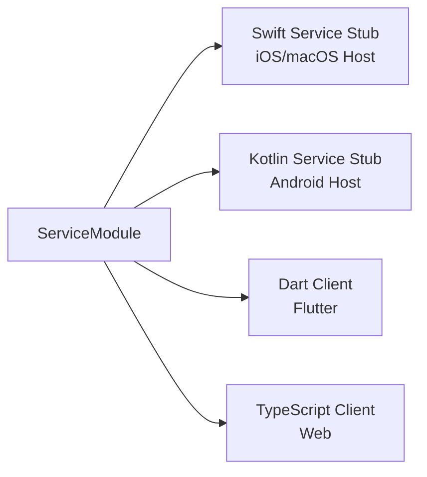
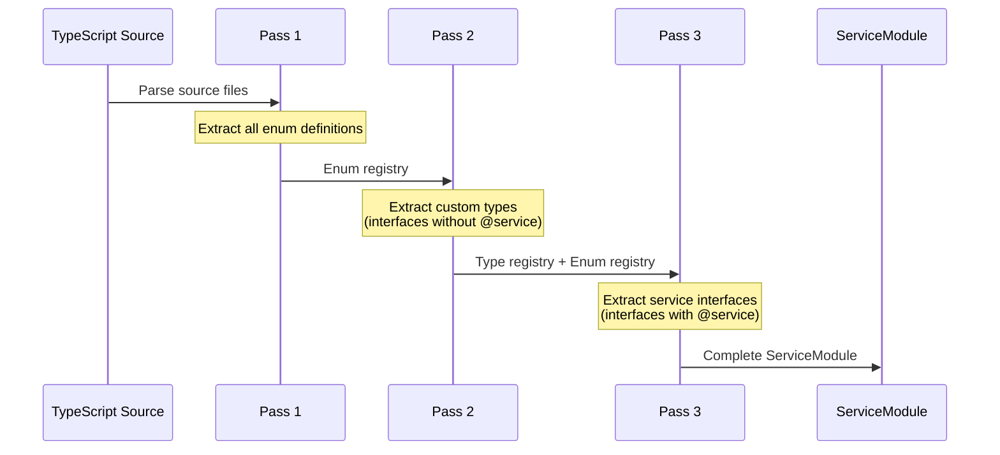
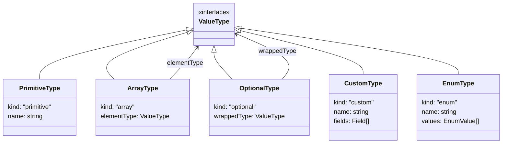
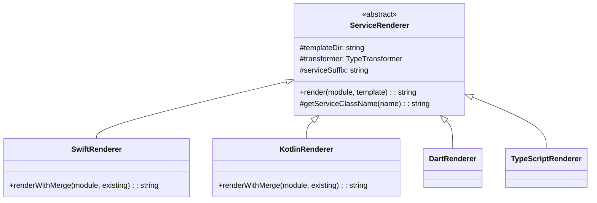
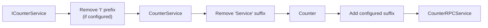
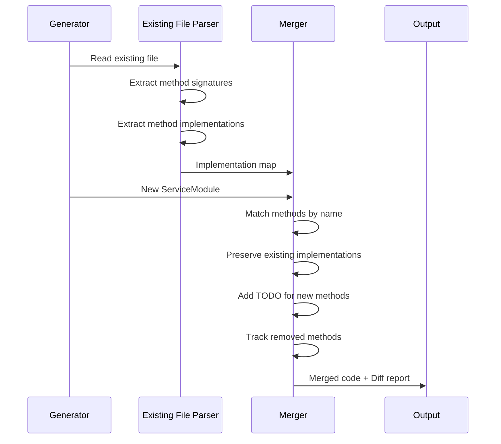

# NativeRPC Code Generator Architecture

This document provides a deep dive into the architecture, design principles, and implementation details of the NativeRPC code generator.

## Table of Contents

1. [Overview](#overview)
2. [Architecture Diagram](#architecture-diagram)
3. [Core Data Flow](#core-data-flow)
4. [Three-Pass Parsing Strategy](#three-pass-parsing-strategy)
5. [Type System](#type-system)
6. [Renderer Architecture](#renderer-architecture)
7. [Incremental Merge Mechanism](#incremental-merge-mechanism)
8. [Template System](#template-system)
9. [Extension Guide](#extension-guide)

---

## Overview

NativeRPC Code Generator transforms TypeScript interface definitions into type-safe client and service code for multiple platforms. The generator uses a classic **Parse-Transform-Render** three-stage architecture, ensuring clean separation of concerns and easy extensibility.

### Design Goals

- **Single Source of Truth**: Define services once in TypeScript, generate everywhere
- **Type Safety**: Full type information preserved across all generated code
- **Developer Experience**: Incremental updates preserve hand-written implementations
- **Extensibility**: Easy to add new target languages or customize output

---

## Architecture Diagram

```mermaid
flowchart TB
    subgraph Input["Input Layer"]
        TS[TypeScript Interfaces<br/>@service, @serviceName]
        Config[nativerpc.config.json]
    end

    subgraph Parser["Parser Layer"]
        TSC[TypeScript Compiler API]
        Pass1[Pass 1: Enum Types]
        Pass2[Pass 2: Custom Types]
        Pass3[Pass 3: Service Interfaces]
    end

    subgraph IR["Intermediate Representation"]
        SM[ServiceModule]
        Methods[ServiceMethod[]]
        Events[ServiceEvent[]]
        Types[CustomType[]]
        Enums[EnumType[]]
    end

    subgraph Validator["Validation Layer"]
        TypeCheck[Type Validation]
        NamingCheck[Naming Conflict Check]
        EnumCheck[Enum Validation]
    end

    subgraph Renderer["Renderer Layer"]
        SwiftR[Swift Renderer]
        KotlinR[Kotlin Renderer]
        DartR[Dart Renderer]
        TSR[TypeScript Renderer]
    end

    subgraph Merger["Merge Layer"]
        SwiftM[Swift Merger]
        KotlinM[Kotlin Merger]
    end

    subgraph Output["Output Layer"]
        Swift[.swift Service Stubs]
        Kotlin[.kt Service Stubs]
        Dart[.dart Client]
        TSOut[.ts Client]
    end

    TS --> TSC
    Config --> TSC
    TSC --> Pass1 --> Pass2 --> Pass3
    Pass3 --> SM
    SM --> Methods & Events & Types & Enums
    
    SM --> Validator
    Validator --> TypeCheck & NamingCheck & EnumCheck
    
    Validator --> SwiftR & KotlinR & DartR & TSR
    
    SwiftR --> SwiftM --> Swift
    KotlinR --> KotlinM --> Kotlin
    DartR --> Dart
    TSR --> TSOut
```

---

## Core Data Flow

### 1. Input: TypeScript Interface Definition

The generator accepts TypeScript interfaces decorated with JSDoc annotations:

```typescript
/**
 * Counter Service - manages a numeric counter
 * @service
 * @serviceName counter
 */
export interface ICounterService {
  /** Get current counter value */
  getValue(): number;
  
  /** Async operation with delay */
  fetchValue(): Promise<number>;
  
  /** Event fired when value changes */
  onValueChanged(): Event<{ oldValue: number; newValue: number }>;
}
```

Key annotations:
- `@service` - Marks interface as a service definition
- `@serviceName` - Defines the RPC service identifier

### 2. Intermediate Representation: ServiceModule

After parsing, a platform-agnostic intermediate representation is created:

```typescript
interface ServiceModule {
  name: string;              // "CounterService"
  serviceName: string;       // "counter" (from @serviceName)
  documentation: string;     // "Counter Service - manages a numeric counter"
  methods: ServiceMethod[];  // All sync/async methods
  events: ServiceEvent[];    // All event definitions
  customTypes: CustomType[]; // Referenced custom types
  enums: EnumType[];         // Referenced enum types
}

interface ServiceMethod {
  name: string;              // "getValue"
  documentation: string;     // "Get current counter value"
  kind: MethodKind;          // Sync | Async | Void
  parameters: Parameter[];   // Method parameters
  returnType: ValueType;     // Return type
}

interface ServiceEvent {
  name: string;              // "valueChanged" (without "on" prefix)
  documentation: string;     // "Event fired when value changes"
  payloadType: ValueType;    // Event payload type
}
```

### 3. Output: Multi-Platform Code

From the ServiceModule, platform-specific code is generated:



| Platform | Role | Generated Code Type |
|----------|------|---------------------|
| Swift | Host (Server) | Service implementation stubs |
| Kotlin | Host (Server) | Service implementation stubs |
| Dart | Client | RPC client wrappers |
| TypeScript | Client | RPC client wrappers |

---

## Three-Pass Parsing Strategy

The parser (`src/parser/index.ts`) uses the TypeScript Compiler API and performs three sequential passes to correctly resolve type dependencies:



### Pass 1: Enum Types

First, all enum definitions are extracted and registered:

```typescript
// Input
enum CounterMode {
  Normal = "normal",
  Debug = "debug"
}

// Output: EnumType
{
  name: "CounterMode",
  values: [
    { name: "Normal", value: "normal" },
    { name: "Debug", value: "debug" }
  ]
}
```

**Why first?** Enums can be referenced by custom types and service methods. They must be available before parsing other types.

### Pass 2: Custom Types

Next, all non-service interfaces are parsed as custom types:

```typescript
// Input
export interface CounterStats {
  incrementCount: number;
  decrementCount: number;
  mode: CounterMode;  // References enum from Pass 1
}

// Output: CustomType
{
  name: "CounterStats",
  fields: [
    { name: "incrementCount", type: PrimitiveType.Number },
    { name: "decrementCount", type: PrimitiveType.Number },
    { name: "mode", type: EnumType("CounterMode") }
  ]
}
```

**Why second?** Custom types can reference enums (already parsed) and other custom types. The parser handles forward references.

### Pass 3: Service Interfaces

Finally, interfaces marked with `@service` are parsed:

```typescript
// Input
/**
 * @service
 * @serviceName counter
 */
export interface ICounterService {
  getStats(): CounterStats;  // References custom type from Pass 2
  onModeChanged(): Event<CounterMode>;  // References enum from Pass 1
}

// Output: ServiceModule
{
  name: "CounterService",
  serviceName: "counter",
  methods: [...],
  events: [...],
  customTypes: [CounterStats],  // Collected dependencies
  enums: [CounterMode]          // Collected dependencies
}
```

**Why last?** Services reference both enums and custom types. Parsing them last ensures all dependencies are resolved.

---

## Type System

### ValueType Union

All types are represented as a discriminated union:

```typescript
type ValueType = 
  | PrimitiveType      // string, number, boolean, Int, Date, etc.
  | ArrayType          // Array<T>, T[]
  | OptionalType       // T | null, T | undefined
  | MapType            // Record<K, V>, Map<K, V>
  | CustomType         // User-defined interfaces
  | EnumType           // Enum types
  | VoidType           // void
  | UnknownType;       // Fallback for unrecognized types
```



### Type Inference Rules

The parser infers method kinds from return types:

| Return Type Pattern | Inferred Kind | Example |
|---------------------|---------------|---------|
| `T` (non-Promise) | Sync | `getValue(): number` |
| `Promise<T>` | Async | `fetchValue(): Promise<number>` |
| `void` | Void | `reset(): void` |
| `Event<T>` | Event | `onChanged(): Event<Payload>` |

### Inline Type Naming

Anonymous inline types receive generated names:

```typescript
// Input
onValueChanged(): Event<{ oldValue: number; newValue: number }>;

// Generated type name: "ValueChangedPayload"
// Naming pattern: {EventName}Payload
```

| Context | Naming Pattern | Example |
|---------|---------------|---------|
| Event payload | `{EventName}Payload` | `ValueChangedPayload` |
| Method params | `{MethodName}Params` | `GetValueParams` |
| Method result | `{MethodName}Result` | `GetValueResult` |

---

## Renderer Architecture

### Class Hierarchy



### Type Transformers

Each renderer has an associated TypeTransformer that converts TypeScript types to target language types:

```typescript
abstract class TypeTransformer {
  abstract transform(type: ValueType): string;
  abstract transformOptional(type: ValueType): string;
  abstract transformArray(type: ValueType): string;
}
```

**Type Mapping Table:**

| TypeScript | Swift | Kotlin | Dart | TypeScript (output) |
|------------|-------|--------|------|---------------------|
| `string` | `String` | `String` | `String` | `string` |
| `number` | `Double` | `Double` | `double` | `number` |
| `Int` | `Int` | `Int` | `int` | `number` |
| `boolean` | `Bool` | `Boolean` | `bool` | `boolean` |
| `Date` | `Date` | `Date` | `DateTime` | `Date` |
| `T[]` | `[T]` | `List<T>` | `List<T>` | `T[]` |
| `T \| null` | `T?` | `T?` | `T?` | `T \| null` |
| `Record<K,V>` | `[K: V]` | `Map<K, V>` | `Map<K, V>` | `Record<K, V>` |

### Service Naming Convention



Configuration: `rendering.serviceSuffix` (default: `"RPCService"`)

### File Naming Convention

| Language | Pattern | Example |
|----------|---------|---------|
| Swift | `{ClassName}.swift` | `CounterRPCService.swift` |
| Kotlin | `{ClassName}.kt` | `CounterRPCService.kt` |
| Dart | `{snake_case}.dart` | `counter_rpc_service.dart` |
| TypeScript | `{kebab-case}.ts` | `counter-rpc-service.ts` |

---

## Incremental Merge Mechanism

The merge system (`src/merger/index.ts`) preserves hand-written implementations when regenerating Swift and Kotlin code.

### Workflow



### Implementation Extraction

The merger parses existing code to extract implementations:

```swift
// Existing file
Function("getValue") { () -> Int in
    return self.counter  // ← This implementation is preserved
}

Function("add") { (value: Int) -> Int in
    self.counter += value  // ← This implementation is preserved
    return self.counter
}
```

### Merge Behavior

| Scenario | Action |
|----------|--------|
| Method exists in both | Keep existing implementation |
| New method in schema | Generate TODO placeholder |
| Method removed from schema | Warn user (implementation lost) |
| Signature changed | Update signature, keep implementation |

### Diff Report

After merging, a diff report is generated:

```
=== Method Diff Report ===

➕ Added methods:
   + newMethod           // TODO placeholder generated

➖ Removed methods (implementation will be lost):
   - deprecatedMethod    // Warning for user

✓ 5 methods unchanged   // Implementations preserved
```

---

## Template System

The generator uses [Mustache](https://mustache.github.io/) templates for code generation.

### Template Structure

```
templates/
├── dart/
│   ├── service.mustache      # Client class
│   └── types.mustache        # Type definitions
├── kotlin/
│   ├── service.mustache      # Service stub
│   └── types.mustache        # Data classes
├── swift/
│   ├── service.mustache      # Service stub
│   └── types.mustache        # Struct definitions
└── typescript/
    ├── service.mustache      # Client class
    └── types.mustache        # Type definitions
```

### Template Context

Templates receive a context object with the ServiceModule data:

```typescript
interface TemplateContext {
  className: string;           // "CounterRPCService"
  serviceName: string;         // "counter"
  documentation: string;       // Service documentation
  methods: MethodContext[];    // Transformed methods
  events: EventContext[];      // Transformed events
  customTypes: TypeContext[];  // Transformed types
  enums: EnumContext[];        // Transformed enums
  imports: string[];           // Import statements
  packageName?: string;        // Package/module name
}
```

### Custom Templates

Override built-in templates in configuration:

```json
{
  "rendering": {
    "swift": {
      "templatePath": "./my-templates/custom-swift.mustache"
    }
  }
}
```

---

## Extension Guide

### Adding a New Target Language

1. **Create a TypeTransformer subclass**

```typescript
class RustTypeTransformer extends TypeTransformer {
  transform(type: ValueType): string {
    if (type.kind === 'primitive') {
      switch (type.name) {
        case 'string': return 'String';
        case 'number': return 'f64';
        case 'boolean': return 'bool';
        // ...
      }
    }
    // Handle other types...
  }
}
```

2. **Create a Renderer subclass**

```typescript
class RustRenderer extends ServiceRenderer {
  constructor(config: RustRenderConfiguration) {
    super();
    this.templateDir = 'rust';
    this.transformer = new RustTypeTransformer();
  }
  
  getFileName(module: ServiceModule): string {
    return `${toSnakeCase(this.getServiceClassName(module.name))}.rs`;
  }
}
```

3. **Create Mustache templates**

```mustache
{{! templates/rust/service.mustache }}
// Generated by NativeRPC Code Generator

pub struct {{className}} {
    client: NativeRpcClient,
}

impl {{className}} {
    {{#methods}}
    pub async fn {{name}}(&self{{#parameters}}, {{name}}: {{type}}{{/parameters}}) -> Result<{{returnType}}, Error> {
        self.client.call("{{serviceName}}.{{name}}", params).await
    }
    {{/methods}}
}
```

4. **Register in the generator**

```typescript
// src/index.ts
class NativeRPCCodeGenerator {
  private renderers = {
    swift: new SwiftRenderer(config.swift),
    kotlin: new KotlinRenderer(config.kotlin),
    dart: new DartRenderer(config.dart),
    typescript: new TypeScriptRenderer(config.typescript),
    rust: new RustRenderer(config.rust),  // Add new renderer
  };
}
```

---

## File Structure

```
codegen/
├── src/
│   ├── index.ts                    # Main entry, NativeRPCCodeGenerator class
│   ├── types.ts                    # Core type definitions (ValueType, ServiceModule, etc.)
│   ├── config.ts                   # Configuration types
│   ├── cli/
│   │   └── index.ts                # CLI implementation (Commander.js)
│   ├── parser/
│   │   └── index.ts                # TypeScript parser (three-pass)
│   ├── validator/
│   │   └── index.ts                # Service definition validation
│   ├── renderer/
│   │   ├── index.ts                # Renderer base class and implementations
│   │   └── type-transformer.ts     # Type transformers for each language
│   └── merger/
│       └── index.ts                # Incremental merge logic
│
├── templates/
│   ├── dart/                       # Dart Mustache templates
│   ├── kotlin/                     # Kotlin Mustache templates
│   ├── swift/                      # Swift Mustache templates
│   └── typescript/                 # TypeScript Mustache templates
│
├── examples/
│   ├── services.ts                 # Example service definitions
│   └── config.json                 # Example configuration
│
├── bin/
│   └── nativerpc-codegen           # CLI entry script
│
├── package.json
├── tsconfig.json
├── README.md                       # User documentation (English)
├── README.zh-CN.md                 # User documentation (Chinese)
└── AGENTS.md                       # Developer documentation
```

---

## Related Resources

- **Main SDK**: `../sdk/` - iOS and Android SDK implementations
- **Flutter Connection**: `../connections/flutter/` - Flutter plugin
- **Protocol Docs**: `./ARCHITECTURE.md` - Overall NativeRPC architecture
- **Inspiration**: [microsoft/ts-gyb](https://github.com/microsoft/ts-gyb)
