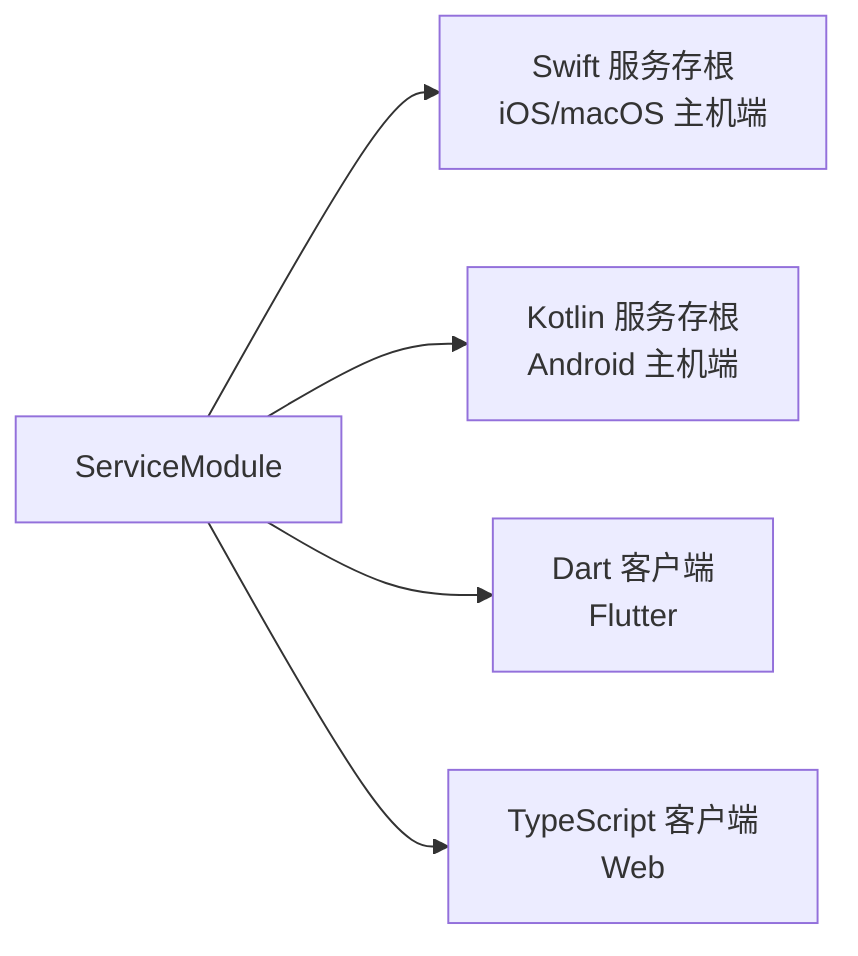
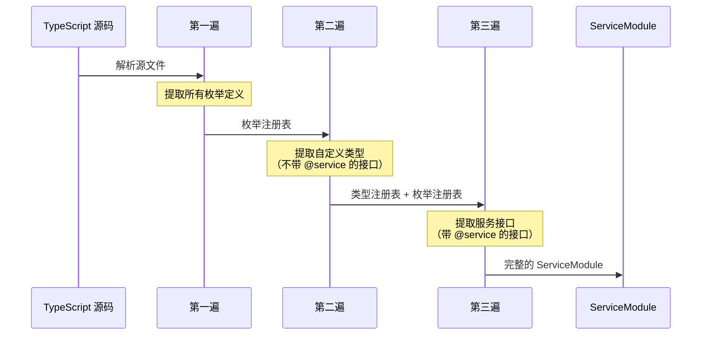
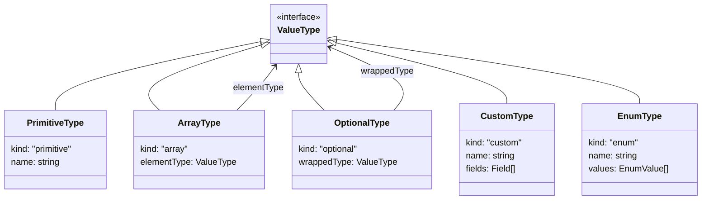
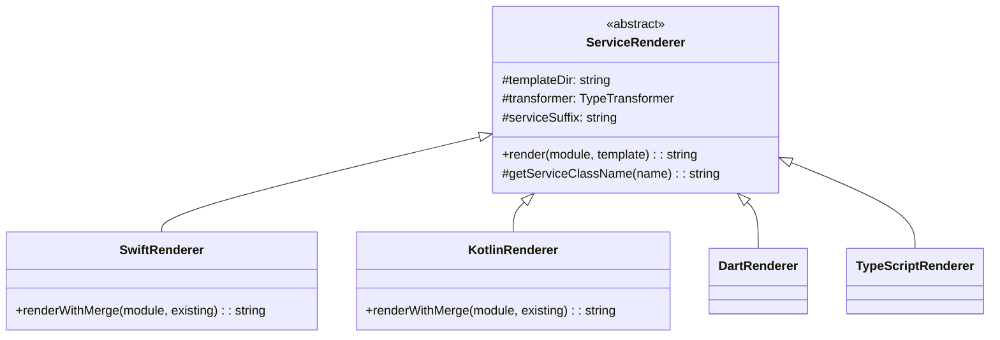
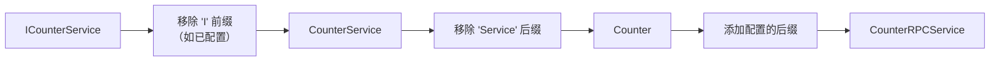
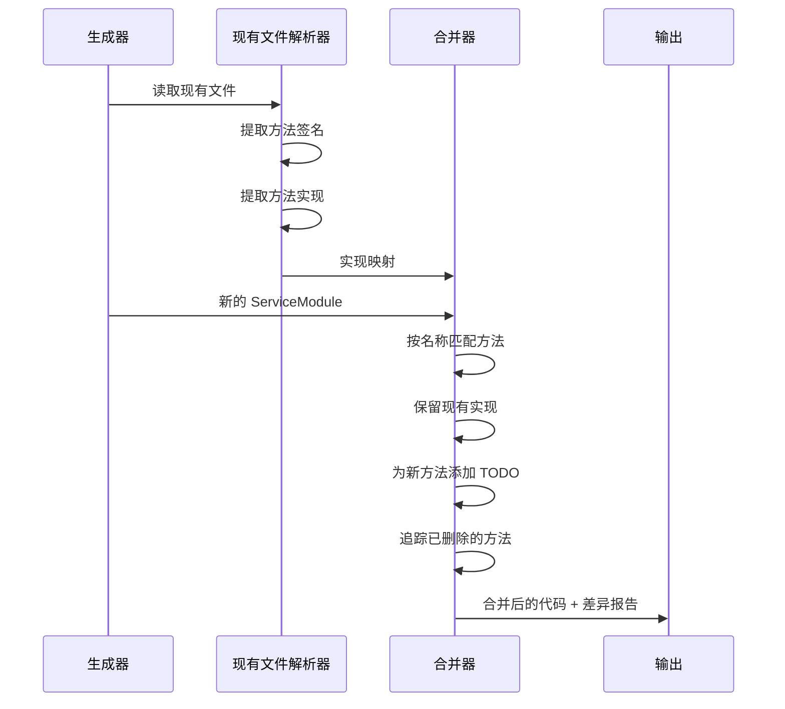

# NativeRPC 代码生成器架构

本文档深入介绍 NativeRPC 代码生成器的架构、设计原则和实现细节。

## 目录

1. [概述](#概述)
2. [架构图](#架构图)
3. [核心数据流](#核心数据流)
4. [三遍解析策略](#三遍解析策略)
5. [类型系统](#类型系统)
6. [渲染器架构](#渲染器架构)
7. [增量合并机制](#增量合并机制)
8. [模板系统](#模板系统)
9. [扩展指南](#扩展指南)

---

## 概述

NativeRPC 代码生成器将 TypeScript 接口定义转换为多平台的类型安全客户端和服务代码。生成器采用经典的 **解析-转换-渲染** 三阶段架构，确保关注点清晰分离且易于扩展。

### 设计目标

- **单一数据源**: 在 TypeScript 中定义一次服务，到处生成
- **类型安全**: 在所有生成代码中保留完整的类型信息
- **开发体验**: 增量更新保留手写的实现代码
- **可扩展性**: 易于添加新的目标语言或自定义输出

---

## 架构图

```mermaid
flowchart TB
    subgraph Input["输入层"]
        TS[TypeScript 接口<br/>@service, @serviceName]
        Config[nativerpc.config.json]
    end

    subgraph Parser["解析层"]
        TSC[TypeScript 编译器 API]
        Pass1[第一遍: 枚举类型]
        Pass2[第二遍: 自定义类型]
        Pass3[第三遍: 服务接口]
    end

    subgraph IR["中间表示"]
        SM[ServiceModule]
        Methods[ServiceMethod[]]
        Events[ServiceEvent[]]
        Types[CustomType[]]
        Enums[EnumType[]]
    end

    subgraph Validator["验证层"]
        TypeCheck[类型验证]
        NamingCheck[命名冲突检查]
        EnumCheck[枚举验证]
    end

    subgraph Renderer["渲染层"]
        SwiftR[Swift 渲染器]
        KotlinR[Kotlin 渲染器]
        DartR[Dart 渲染器]
        TSR[TypeScript 渲染器]
    end

    subgraph Merger["合并层"]
        SwiftM[Swift 合并器]
        KotlinM[Kotlin 合并器]
    end

    subgraph Output["输出层"]
        Swift[.swift 服务存根]
        Kotlin[.kt 服务存根]
        Dart[.dart 客户端]
        TSOut[.ts 客户端]
    end

    TS --> TSC
    Config --> TSC
    TSC --> Pass1 --> Pass2 --> Pass3
    Pass3 --> SM
    SM --> Methods & Events & Types & Enums
    
    SM --> Validator
    Validator --> TypeCheck & NamingCheck & EnumCheck
    
    Validator --> SwiftR & KotlinR & DartR & TSR
    
    SwiftR --> SwiftM --> Swift
    KotlinR --> KotlinM --> Kotlin
    DartR --> Dart
    TSR --> TSOut
```

---

## 核心数据流

### 1. 输入: TypeScript 接口定义

生成器接受带有 JSDoc 注解的 TypeScript 接口：

```typescript
/**
 * 计数器服务 - 管理一个数值计数器
 * @service
 * @serviceName counter
 */
export interface ICounterService {
  /** 获取当前计数器值 */
  getValue(): number;
  
  /** 带延迟的异步操作 */
  fetchValue(): Promise<number>;
  
  /** 值变化时触发的事件 */
  onValueChanged(): Event<{ oldValue: number; newValue: number }>;
}
```

关键注解：
- `@service` - 将接口标记为服务定义
- `@serviceName` - 定义 RPC 服务标识符

### 2. 中间表示: ServiceModule

解析后，创建与平台无关的中间表示：

```typescript
interface ServiceModule {
  name: string;              // "CounterService"
  serviceName: string;       // "counter"（来自 @serviceName）
  documentation: string;     // "计数器服务 - 管理一个数值计数器"
  methods: ServiceMethod[];  // 所有同步/异步方法
  events: ServiceEvent[];    // 所有事件定义
  customTypes: CustomType[]; // 引用的自定义类型
  enums: EnumType[];         // 引用的枚举类型
}

interface ServiceMethod {
  name: string;              // "getValue"
  documentation: string;     // "获取当前计数器值"
  kind: MethodKind;          // Sync | Async | Void
  parameters: Parameter[];   // 方法参数
  returnType: ValueType;     // 返回类型
}

interface ServiceEvent {
  name: string;              // "valueChanged"（不含 "on" 前缀）
  documentation: string;     // "值变化时触发的事件"
  payloadType: ValueType;    // 事件载荷类型
}
```

### 3. 输出: 多平台代码

从 ServiceModule 生成特定平台的代码：



| 平台 | 角色 | 生成代码类型 |
|----------|------|---------------------|
| Swift | 主机端（服务器） | 服务实现存根 |
| Kotlin | 主机端（服务器） | 服务实现存根 |
| Dart | 客户端 | RPC 客户端包装器 |
| TypeScript | 客户端 | RPC 客户端包装器 |

---

## 三遍解析策略

解析器（`src/parser/index.ts`）使用 TypeScript 编译器 API，执行三次顺序扫描以正确解析类型依赖：



### 第一遍: 枚举类型

首先，提取并注册所有枚举定义：

```typescript
// 输入
enum CounterMode {
  Normal = "normal",
  Debug = "debug"
}

// 输出: EnumType
{
  name: "CounterMode",
  values: [
    { name: "Normal", value: "normal" },
    { name: "Debug", value: "debug" }
  ]
}
```

**为什么首先处理？** 枚举可以被自定义类型和服务方法引用，必须在解析其他类型之前可用。

### 第二遍: 自定义类型

接下来，将所有非服务接口解析为自定义类型：

```typescript
// 输入
export interface CounterStats {
  incrementCount: number;
  decrementCount: number;
  mode: CounterMode;  // 引用第一遍中的枚举
}

// 输出: CustomType
{
  name: "CounterStats",
  fields: [
    { name: "incrementCount", type: PrimitiveType.Number },
    { name: "decrementCount", type: PrimitiveType.Number },
    { name: "mode", type: EnumType("CounterMode") }
  ]
}
```

**为什么第二处理？** 自定义类型可以引用枚举（已解析）和其他自定义类型。解析器处理前向引用。

### 第三遍: 服务接口

最后，解析标记为 `@service` 的接口：

```typescript
// 输入
/**
 * @service
 * @serviceName counter
 */
export interface ICounterService {
  getStats(): CounterStats;  // 引用第二遍中的自定义类型
  onModeChanged(): Event<CounterMode>;  // 引用第一遍中的枚举
}

// 输出: ServiceModule
{
  name: "CounterService",
  serviceName: "counter",
  methods: [...],
  events: [...],
  customTypes: [CounterStats],  // 收集的依赖
  enums: [CounterMode]          // 收集的依赖
}
```

**为什么最后处理？** 服务同时引用枚举和自定义类型。最后解析可确保所有依赖都已解析。

---

## 类型系统

### ValueType 联合类型

所有类型都表示为可区分联合类型：

```typescript
type ValueType = 
  | PrimitiveType      // string, number, boolean, Int, Date 等
  | ArrayType          // Array<T>, T[]
  | OptionalType       // T | null, T | undefined
  | MapType            // Record<K, V>, Map<K, V>
  | CustomType         // 用户定义的接口
  | EnumType           // 枚举类型
  | VoidType           // void
  | UnknownType;       // 未识别类型的后备
```



### 类型推断规则

解析器从返回类型推断方法类型：

| 返回类型模式 | 推断类型 | 示例 |
|---------------------|---------------|---------|
| `T`（非 Promise） | 同步 | `getValue(): number` |
| `Promise<T>` | 异步 | `fetchValue(): Promise<number>` |
| `void` | 无返回值 | `reset(): void` |
| `Event<T>` | 事件 | `onChanged(): Event<Payload>` |

### 内联类型命名

匿名内联类型会获得生成的名称：

```typescript
// 输入
onValueChanged(): Event<{ oldValue: number; newValue: number }>;

// 生成的类型名: "ValueChangedPayload"
// 命名模式: {EventName}Payload
```

| 上下文 | 命名模式 | 示例 |
|---------|---------------|---------|
| 事件载荷 | `{EventName}Payload` | `ValueChangedPayload` |
| 方法参数 | `{MethodName}Params` | `GetValueParams` |
| 方法结果 | `{MethodName}Result` | `GetValueResult` |

---

## 渲染器架构

### 类层次结构



### 类型转换器

每个渲染器都有关联的 TypeTransformer，将 TypeScript 类型转换为目标语言类型：

```typescript
abstract class TypeTransformer {
  abstract transform(type: ValueType): string;
  abstract transformOptional(type: ValueType): string;
  abstract transformArray(type: ValueType): string;
}
```

**类型映射表：**

| TypeScript | Swift | Kotlin | Dart | TypeScript（输出） |
|------------|-------|--------|------|---------------------|
| `string` | `String` | `String` | `String` | `string` |
| `number` | `Double` | `Double` | `double` | `number` |
| `Int` | `Int` | `Int` | `int` | `number` |
| `boolean` | `Bool` | `Boolean` | `bool` | `boolean` |
| `Date` | `Date` | `Date` | `DateTime` | `Date` |
| `T[]` | `[T]` | `List<T>` | `List<T>` | `T[]` |
| `T \| null` | `T?` | `T?` | `T?` | `T \| null` |
| `Record<K,V>` | `[K: V]` | `Map<K, V>` | `Map<K, V>` | `Record<K, V>` |

### 服务命名规范



配置项：`rendering.serviceSuffix`（默认：`"RPCService"`）

### 文件命名规范

| 语言 | 模式 | 示例 |
|----------|---------|---------|
| Swift | `{ClassName}.swift` | `CounterRPCService.swift` |
| Kotlin | `{ClassName}.kt` | `CounterRPCService.kt` |
| Dart | `{snake_case}.dart` | `counter_rpc_service.dart` |
| TypeScript | `{kebab-case}.ts` | `counter-rpc-service.ts` |

---

## 增量合并机制

合并系统（`src/merger/index.ts`）在重新生成 Swift 和 Kotlin 代码时保留手写的实现。

### 工作流程



### 实现提取

合并器解析现有代码以提取实现：

```swift
// 现有文件
Function("getValue") { () -> Int in
    return self.counter  // ← 此实现被保留
}

Function("add") { (value: Int) -> Int in
    self.counter += value  // ← 此实现被保留
    return self.counter
}
```

### 合并行为

| 场景 | 操作 |
|----------|--------|
| 方法在两者中都存在 | 保留现有实现 |
| 架构中的新方法 | 生成 TODO 占位符 |
| 从架构中删除的方法 | 警告用户（实现丢失） |
| 签名变更 | 更新签名，保留实现 |

### 差异报告

合并后，生成差异报告：

```
=== 方法差异报告 ===

➕ 新增方法:
   + newMethod           // 生成 TODO 占位符

➖ 删除方法（实现将丢失）:
   - deprecatedMethod    // 向用户发出警告

✓ 5 个方法未变更   // 实现已保留
```

---

## 模板系统

生成器使用 [Mustache](https://mustache.github.io/) 模板进行代码生成。

### 模板结构

```
templates/
├── dart/
│   ├── service.mustache      # 客户端类
│   └── types.mustache        # 类型定义
├── kotlin/
│   ├── service.mustache      # 服务存根
│   └── types.mustache        # 数据类
├── swift/
│   ├── service.mustache      # 服务存根
│   └── types.mustache        # 结构体定义
└── typescript/
    ├── service.mustache      # 客户端类
    └── types.mustache        # 类型定义
```

### 模板上下文

模板接收包含 ServiceModule 数据的上下文对象：

```typescript
interface TemplateContext {
  className: string;           // "CounterRPCService"
  serviceName: string;         // "counter"
  documentation: string;       // 服务文档
  methods: MethodContext[];    // 转换后的方法
  events: EventContext[];      // 转换后的事件
  customTypes: TypeContext[];  // 转换后的类型
  enums: EnumContext[];        // 转换后的枚举
  imports: string[];           // import 语句
  packageName?: string;        // 包/模块名
}
```

### 自定义模板

在配置中覆盖内置模板：

```json
{
  "rendering": {
    "swift": {
      "templatePath": "./my-templates/custom-swift.mustache"
    }
  }
}
```

---

## 扩展指南

### 添加新的目标语言

1. **创建 TypeTransformer 子类**

```typescript
class RustTypeTransformer extends TypeTransformer {
  transform(type: ValueType): string {
    if (type.kind === 'primitive') {
      switch (type.name) {
        case 'string': return 'String';
        case 'number': return 'f64';
        case 'boolean': return 'bool';
        // ...
      }
    }
    // 处理其他类型...
  }
}
```

2. **创建 Renderer 子类**

```typescript
class RustRenderer extends ServiceRenderer {
  constructor(config: RustRenderConfiguration) {
    super();
    this.templateDir = 'rust';
    this.transformer = new RustTypeTransformer();
  }
  
  getFileName(module: ServiceModule): string {
    return `${toSnakeCase(this.getServiceClassName(module.name))}.rs`;
  }
}
```

3. **创建 Mustache 模板**

```mustache
{{! templates/rust/service.mustache }}
// 由 NativeRPC 代码生成器生成

pub struct {{className}} {
    client: NativeRpcClient,
}

impl {{className}} {
    {{#methods}}
    pub async fn {{name}}(&self{{#parameters}}, {{name}}: {{type}}{{/parameters}}) -> Result<{{returnType}}, Error> {
        self.client.call("{{serviceName}}.{{name}}", params).await
    }
    {{/methods}}
}
```

4. **在生成器中注册**

```typescript
// src/index.ts
class NativeRPCCodeGenerator {
  private renderers = {
    swift: new SwiftRenderer(config.swift),
    kotlin: new KotlinRenderer(config.kotlin),
    dart: new DartRenderer(config.dart),
    typescript: new TypeScriptRenderer(config.typescript),
    rust: new RustRenderer(config.rust),  // 添加新渲染器
  };
}
```

---

## 文件结构

```
codegen/
├── src/
│   ├── index.ts                    # 主入口，NativeRPCCodeGenerator 类
│   ├── types.ts                    # 核心类型定义（ValueType, ServiceModule 等）
│   ├── config.ts                   # 配置类型
│   ├── cli/
│   │   └── index.ts                # CLI 实现（Commander.js）
│   ├── parser/
│   │   └── index.ts                # TypeScript 解析器（三遍）
│   ├── validator/
│   │   └── index.ts                # 服务定义验证
│   ├── renderer/
│   │   ├── index.ts                # 渲染器基类和实现
│   │   └── type-transformer.ts     # 各语言的类型转换器
│   └── merger/
│       └── index.ts                # 增量合并逻辑
│
├── templates/
│   ├── dart/                       # Dart Mustache 模板
│   ├── kotlin/                     # Kotlin Mustache 模板
│   ├── swift/                      # Swift Mustache 模板
│   └── typescript/                 # TypeScript Mustache 模板
│
├── examples/
│   ├── services.ts                 # 示例服务定义
│   └── config.json                 # 示例配置
│
├── bin/
│   └── nativerpc-codegen           # CLI 入口脚本
│
├── package.json
├── tsconfig.json
├── README.md                       # 用户文档（英文）
├── README.zh-CN.md                 # 用户文档（中文）
└── AGENTS.md                       # 开发者文档
```

---

## 相关资源

- **主 SDK**: `../sdk/` - iOS 和 Android SDK 实现
- **Flutter 连接**: `../connections/flutter/` - Flutter 插件
- **协议文档**: `./ARCHITECTURE.md` - NativeRPC 整体架构
- **灵感来源**: [microsoft/ts-gyb](https://github.com/microsoft/ts-gyb)
