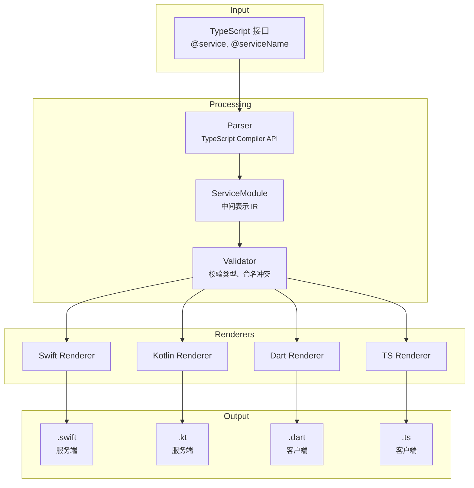

# NativeRPC 代码生成器示例

本文档展示从 TypeScript 接口定义到多语言输出的代码生成流程。

## 输入: TypeScript 服务定义

```typescript
/**
 * Counter Service
 * 
 * @service
 * @serviceName counter
 */
export interface ICounterService {
  /** 获取当前计数值 */
  getValue(): number;
  
  /** 计数器加 1 */
  increment(): number;
  
  /** 给计数器加一个值 */
  add(args: { value: number }): number;
  
  /** 模拟网络延迟获取值 */
  getValueDelayed(args: { delayMs: number }): Promise<number>;
  
  /** 异步加法操作 */
  addAsync(args: { value: number; delayMs?: number }): Promise<CounterResult>;
  
  /** 计数值变化时触发 */
  onCountChanged(): Event<CountChangedPayload>;
}

export interface CounterResult {
  value: number;
  timestamp: number;
  operation: CounterOperation;
}

export enum CounterOperation {
  Increment = 'increment',
  Decrement = 'decrement',
  Add = 'add',
  Reset = 'reset',
}

export interface CountChangedPayload {
  previousValue: number;
  newValue: number;
  operation: CounterOperation;
}
```

---

## 输出: Kotlin (服务端 Stub)

```kotlin
package com.itoken.team

import com.itoken.team.nativerpc.core.NativeRPCService
import com.itoken.team.nativerpc.core.NativeRPCContext
import com.itoken.team.nativerpc.core.NativeRPCServiceFactory
import com.itoken.team.nativerpc.dsl.serviceDefinition

data class CounterResult(
    val value: Double,
    val timestamp: Double,
    val operation: CounterOperation
)

data class CountChangedPayload(
    val previousValue: Double,
    val newValue: Double,
    val operation: CounterOperation
)

enum class CounterOperation(val value: String) {
    INCREMENT("increment"),
    DECREMENT("decrement"),
    ADD("add"),
    RESET("reset");
}

class CounterRPCService(context: NativeRPCContext? = null) : NativeRPCService() {

    companion object {
        val Factory = object : NativeRPCServiceFactory<CounterRPCService> {
            override val serviceName = "counter"
            override fun create(context: NativeRPCContext?) = CounterRPCService(context)
        }
    }

    init {
        this.internalContext = context
    }

    override fun definition() = serviceDefinition {
        Function<Double>("getValue") {
            // TODO: 实现 getValue
            throw NotImplementedError("Not implemented: getValue")
        }
        
        Function<Double>("increment") {
            // TODO: 实现 increment
            throw NotImplementedError("Not implemented: increment")
        }
        
        Function<AddParams, Double>("add") { params ->
            // TODO: 实现 add
            throw NotImplementedError("Not implemented: add")
        }
        
        AsyncFunction<GetValueDelayedParams, Double>("getValueDelayed") { params ->
            // TODO: 实现 getValueDelayed
            throw NotImplementedError("Not implemented: getValueDelayed")
        }
        
        AsyncFunction<AddAsyncParams, CounterResult>("addAsync") { params ->
            // TODO: 实现 addAsync
            throw NotImplementedError("Not implemented: addAsync")
        }
        
        Events("countChanged")
    }

    fun emitCountChanged(payload: CountChangedPayload) {
        emit("countChanged", payload)
    }
}

// 注册: NativeRPCServiceCenter.register(CounterRPCService.Factory)
```

---

## 输出: Dart (客户端)

```dart
import 'package:native_rpc_flutter/native_rpc_flutter.dart';

class CounterResult {
  final double value;
  final double timestamp;
  final CounterOperation operation;

  const CounterResult({
    required this.value,
    required this.timestamp,
    required this.operation,
  });

  factory CounterResult.fromJson(Map<String, dynamic> json) {
    return CounterResult(
      value: (json['value'] as num).toDouble(),
      timestamp: (json['timestamp'] as num).toDouble(),
      operation: CounterOperation.fromValue(json['operation'] as String)!,
    );
  }
}

class CountChangedPayload {
  final double previousValue;
  final double newValue;
  final CounterOperation operation;

  const CountChangedPayload({
    required this.previousValue,
    required this.newValue,
    required this.operation,
  });
}

enum CounterOperation {
  increment('increment'),
  decrement('decrement'),
  add('add'),
  reset('reset');

  final String value;
  const CounterOperation(this.value);

  static CounterOperation? fromValue(String value) {
    return CounterOperation.values.cast<CounterOperation?>().firstWhere(
      (e) => e?.value == value,
      orElse: () => null,
    );
  }
}

class CounterRPCService {
  /// 获取当前计数值
  static Future<double> getValue() async {
    return await NativeRPC.call<double>('counter.getValue');
  }

  /// 计数器加 1
  static Future<double> increment() async {
    return await NativeRPC.call<double>('counter.increment');
  }

  /// 给计数器加一个值
  static Future<double> add({ required double value }) async {
    final params = <String, dynamic>{'value': value};
    return await NativeRPC.call<double>('counter.add', params);
  }

  /// 模拟网络延迟获取值
  static Future<double> getValueDelayed({ required double delayMs }) async {
    final params = <String, dynamic>{'delayMs': delayMs};
    return await NativeRPC.call<double>('counter.getValueDelayed', params);
  }

  /// 异步加法操作
  static Future<CounterResult> addAsync({ required double value, double? delayMs }) async {
    final params = <String, dynamic>{'value': value, 'delayMs': delayMs};
    return await NativeRPC.call<CounterResult>('counter.addAsync', params);
  }

  /// 计数值变化时触发
  static Stream<dynamic> get onCountChanged {
    return NativeRPC.stream('counter.countChanged');
  }
}
```

---

## 输出: TypeScript (客户端)

```typescript
export interface CounterResult {
  value: number;
  timestamp: number;
  operation: CounterOperation;
}

export interface CountChangedPayload {
  previousValue: number;
  newValue: number;
  operation: CounterOperation;
}

export enum CounterOperation {
  Increment = 'increment',
  Decrement = 'decrement',
  Add = 'add',
  Reset = 'reset',
}

export class CounterRPCService {
  private readonly connection: NativeRPCConnection;

  constructor(connection: NativeRPCConnection) {
    this.connection = connection;
  }

  async getValue(): Promise<number> {
    return this.connection.call<number>('counter.getValue');
  }

  async increment(): Promise<number> {
    return this.connection.call<number>('counter.increment');
  }

  async add(params: { value: number }): Promise<number> {
    return this.connection.call<number>('counter.add', params);
  }

  async getValueDelayed(params: { delayMs: number }): Promise<number> {
    return this.connection.call<number>('counter.getValueDelayed', params);
  }

  async addAsync(params: { value: number; delayMs?: number }): Promise<CounterResult> {
    return this.connection.call<CounterResult>('counter.addAsync', params);
  }

  onCountChanged(handler: (payload: CountChangedPayload) => void): () => void {
    return this.connection.subscribe('counter.countChanged', handler);
  }
}

export interface NativeRPCConnection {
  call<T>(method: string, params?: Record<string, unknown>): Promise<T>;
  subscribe(event: string, handler: (data: unknown) => void): () => void;
}
```

---

## 代码生成器工作原理

### 架构概览



### 三遍扫描策略

| 遍次 | 目标 | 说明 |
|------|------|------|
| Pass 1 | Enum 类型 | 解析所有 `enum` 定义 |
| Pass 2 | 自定义类型 | 解析非 `@service` 的 interface |
| Pass 3 | 服务接口 | 解析标记 `@service` 的 interface |

### 方法类型自动推断

生成器根据返回类型自动推断方法类型：

```typescript
getValue(): number           // → 同步方法
fetchData(): Promise<Data>   // → 异步方法  
onChanged(): Event<Payload>  // → 事件
reset(): void                // → Void 方法
```

### 类型映射表

| TypeScript | Swift | Kotlin | Dart |
|------------|-------|--------|------|
| `string` | `String` | `String` | `String` |
| `number` | `Double` | `Double` | `double` |
| `boolean` | `Bool` | `Boolean` | `bool` |
| `T[]` | `[T]` | `List<T>` | `List<T>` |
| `T \| null` | `T?` | `T?` | `T?` |

### 增量合并 (Swift/Kotlin)

服务端 Stub 支持增量更新，保留已有实现：

- 已有方法的实现代码会被保留
- 新方法生成 TODO 占位符
- 删除的方法会报告警告（实现代码将丢失）

---

## 使用方法

```bash
cd codegen
npm install
npm run build
npm run generate -- generate --config examples/config.json
```

### 配置文件示例

```json
{
  "parsing": {
    "sources": ["./services.ts"],
    "dropInterfaceIPrefix": true
  },
  "rendering": {
    "serviceSuffix": "RPCService",
    "dart": {
      "outputPath": "./generated/dart",
      "packageName": "native_rpc_client"
    },
    "typescript": {
      "outputPath": "./generated/typescript",
      "useESModules": true
    },
    "kotlin": {
      "outputPath": "./generated/kotlin",
      "packageName": "com.itoken.team",
      "imports": ["com.itoken.team.nativerpc.*"],
      "baseClass": "NativeRPCService"
    }
  }
}
```

---

## 总结

| 输出 | 类型 | 用途 |
|------|------|------|
| **Kotlin** | 服务端 Stub | 基于 DSL 的服务定义，Factory 模式，事件发送器 |
| **Dart** | 客户端 | 静态方法调用，Stream 事件订阅 |
| **TypeScript** | 客户端 | 基于 Connection 实例的方法调用 |

代码生成器的特性：

1. **类型安全** - 生成的代码完全类型化
2. **增量更新** - 服务端 Stub 保留已有实现
3. **多平台** - 单一源文件生成所有平台代码
4. **约定优于配置** - 合理的默认值，支持自定义
