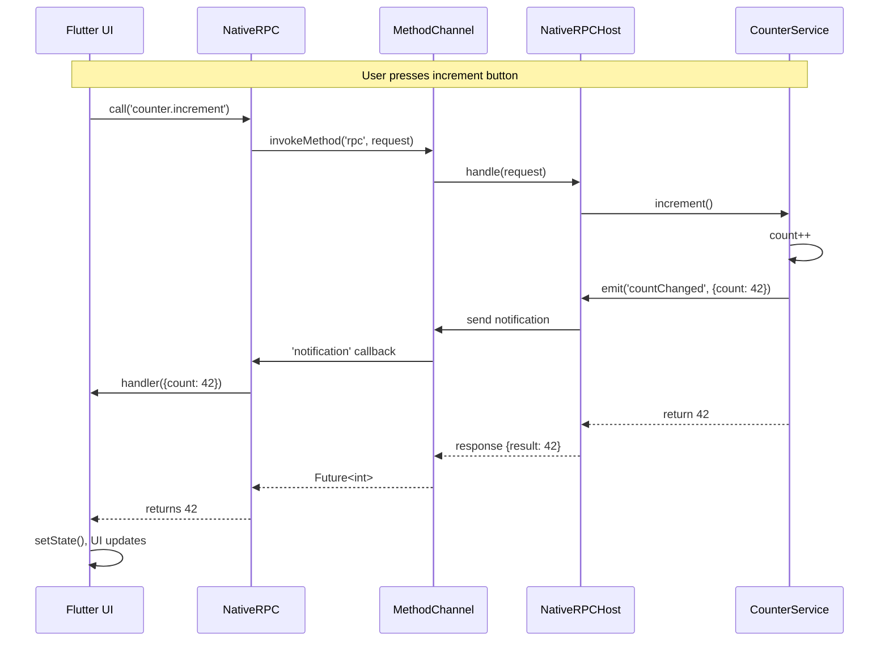

# Flutter Counter Example

This example demonstrates the NativeRPC architecture with a simple counter implementation.

## Protocol

NativeRPC uses a **simplified JSON-RPC 2.0** protocol:

```json
// Request
{"id": "1", "method": "counter.increment", "params": {}}

// Response
{"id": "1", "result": 42}

// Notification (Event)
{"method": "counter.countChanged", "params": {"count": 42}}
```

## Architecture

This app showcases:
- **Flutter UI** calling native code via `native_rpc_flutter` plugin
- **Native Services** implemented in Swift (iOS) and Kotlin (Android)
- **Event Streaming** from native to Flutter (count change notifications)
- **Single Channel** design - all RPC calls share one MethodChannel

## Project Structure

```
flutter_counter/
├── lib/
│   └── main.dart                    # Flutter UI using NativeRPC
├── ios/
│   └── Runner/
│       ├── AppDelegate.swift        # NativeRPC setup
│       └── CounterService.swift     # Swift service implementation
└── android/
    └── app/src/main/kotlin/com/example/flutter_counter/
        ├── MainActivity.kt          # NativeRPC setup
        └── CounterService.kt        # Kotlin service implementation
```

## Service Implementation

### Flutter (Dart)

```dart
import 'package:native_rpc_flutter/native_rpc_flutter.dart';

// Call methods
final value = await NativeRPC.call<int>('counter.increment');

// Listen to events
NativeRPC.on('counter.countChanged', (data) {
  print('Count: ${data["count"]}');
});
```

### iOS (Swift)

```swift
class CounterService: NativeRPCService {
    private var count = 0
    
    @ServiceDefinitionBuilder
    override func definition() -> ServiceDefinitionContainer {
        Name("counter")
        Function("increment") { [weak self] () -> Int in
            self?.count += 1
            self?.emit("countChanged", data: ["count": self?.count])
            return self?.count ?? 0
        }
        Events("countChanged")
    }
}

// Register in AppDelegate
let host = NativeRPCHost()
host.register(CounterService())
host.addConnection(FlutterMethodChannelConnection(...))
```

### Android (Kotlin)

```kotlin
class CounterService : NativeRPCService() {
    private var count = 0
    
    override fun definition() = serviceDefinition {
        Name("counter")
        Function0<Int>("increment") {
            count++
            emit("countChanged", mapOf("count" to count))
            count
        }
        Events("countChanged")
    }
}

// Register in MainActivity
val host = NativeRPCHost()
host.register(CounterService())
host.addConnection(FlutterMethodChannelConnection(...))
```

## Features Demonstrated

1. **Method Calls**: `getValue()`, `increment()`, `decrement()`, `reset()`
2. **Event Streaming**: `countChanged` event emitted on every change
3. **Type Safety**: Dart client expects `int` return values
4. **Error Handling**: Connection status and error display
5. **Single Channel**: All methods/events use one `native_rpc` channel

## Running the Example

### Prerequisites

1. Install Flutter SDK
2. For iOS: Xcode with Swift support
3. For Android: Android Studio with Kotlin support

### Steps

```bash
# Navigate to example directory
cd examples/flutter_counter

# Set China mirror (if needed)
export PUB_HOSTED_URL="https://pub.flutter-io.cn"

# Get dependencies
flutter pub get

# Install iOS pods
cd ios && pod install && cd ..

# Run on device/simulator
flutter run
```

## How It Works

### 1. Initialization

**Flutter** uses the simple `NativeRPC` singleton API:
```dart
// Auto-initializes on first use
NativeRPC.on('counter.countChanged', (data) {
  setState(() => _counter = data['count']);
});
```

**iOS** sets up `NativeRPCHost` and registers services:
```swift
let host = NativeRPCHost()
host.register(CounterService())
host.addConnection(FlutterMethodChannelConnection(...))
```

### 2. Method Calls

When Flutter calls `increment()`:

1. **Dart**: `NativeRPC.call<int>('counter.increment')`
2. **Message**: `{"id": "1", "method": "counter.increment"}`
3. **MethodChannel**: Message sent over `native_rpc` channel
4. **Native Host**: Routes to `CounterService`
5. **Service**: Executes method, increments count
6. **Response**: `{"id": "1", "result": 42}`
7. **Dart**: Future completes with value `42`

### 3. Event Streaming

When count changes:

1. **Service**: Calls `emit("countChanged", data: ["count": 42])`
2. **Host**: Broadcasts to all connections
3. **MethodChannel**: Sends notification `{"method": "counter.countChanged", "params": {"count": 42}}`
4. **Dart**: Handler receives `{"count": 42}`
5. **UI**: `setState()` updates display

## Message Flow Diagram



## Key Concepts

### Protocol-First Design
The same message protocol (simplified JSON-RPC 2.0) works across all platforms. You could replace MethodChannel with WebSocket and the service code wouldn't change.

### SDK Isolation
Native SDKs (`sdk/ios/`, `sdk/android/`) have zero Flutter dependencies. You can use them in non-Flutter apps.

### Single Channel
All services share one channel (`native_rpc`). Services are identified by the `method` field (e.g., `"counter.increment"`).

### Declarative DSL
Services are defined declaratively, not imperatively. The DSL handles registration, routing, and serialization.

## Error Handling

```dart
try {
  final value = await NativeRPC.call<int>('counter.increment');
} on NativeRPCException catch (e) {
  print('Error ${e.code}: ${e.message}');
}
```

## Troubleshooting

### iOS Build Errors

If you see "No such module 'NativeRPCKit'":
1. Ensure `native_rpc_flutter` plugin is properly linked
2. Check that iOS SDK is included in plugin's podspec
3. Run `pod install` in `ios/` directory

### Android Build Errors

If you see "Unresolved reference: NativeRPCHost":
1. Ensure `native_rpc_flutter` plugin is properly configured
2. Check that Android SDK is included in plugin's build.gradle
3. Sync Gradle files

### Connection Errors

If UI shows "Error: ...":
1. Check that MethodChannel name matches on both sides (`native_rpc`)
2. Verify `CounterService` is registered in AppDelegate/MainActivity
3. Ensure plugin is registered via `GeneratedPluginRegistrant`

## Next Steps

After running this example, explore:
- **Generator**: Create services from YAML schemas (`generator/`)
- **Protocol Docs**: Understand message format (`protocol/`)
- **Standalone SDKs**: Use native SDKs without Flutter
- **Custom Connections**: Implement WebSocket or HTTP transport

## Related Documentation

- Main README: `../../README.md`
- iOS SDK: `../../sdk/ios/`
- Android SDK: `../../sdk/android/`
- Dart SDK: `../../connections/flutter/native_rpc/`
- Flutter Plugin: `../../connections/flutter/native_rpc_flutter/`
